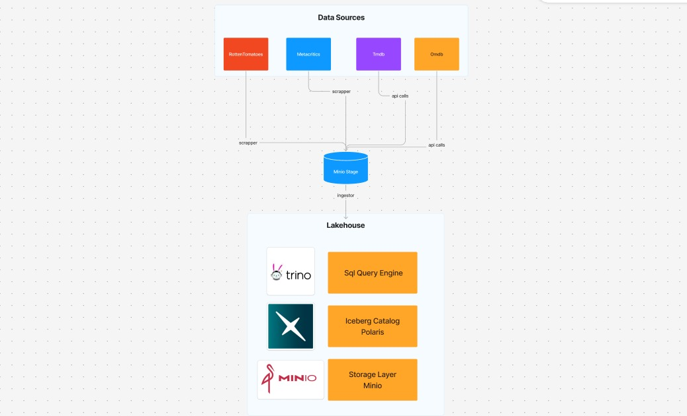

# Movie Ratings Data Pipeline

A comprehensive data engineering pipeline for ingesting, processing, and analyzing movie ratings data from multiple sources including TMDB, OMDb, Metacritic, and Rotten Tomatoes. The pipeline stores data in an Apache Iceberg data lakehouse powered by Trino, Polaris, and MinIO.

## 🏗️ Architecture Overview



The pipeline follows a modern data lakehouse architecture with the following components:

- **Data Sources**: TMDB API, OMDb API, Metacritic, Rotten Tomatoes
- **Storage**: Apache Iceberg tables stored in MinIO S3-compatible storage
- **Catalog**: Apache Polaris for metadata management
- **Query Engine**: Trino for SQL queries and data analysis
- **Data Processing**: Python-based ETL pipeline with comprehensive data enhancement

## 🚀 Features

- **Multi-Source Data Ingestion**: Collects movie data from TMDB, OMDb, Metacritic, and Rotten Tomatoes
- **Data Enhancement**: Enriches TMDB data with additional ratings and metadata
- **Iceberg Integration**: Uses Apache Iceberg for ACID transactions and schema evolution
- **Scalable Storage**: MinIO-based S3-compatible object storage
- **SQL Interface**: Trino provides SQL access to all data
- **Comprehensive Analysis**: Built-in analytics for cast, crew, and collaboration networks

## 📁 Project Structure

```
MovieRatings/
├── assets/                          # Pipeline diagrams and images
├── config/                          # Configuration files
│   ├── env.example                 # Environment variables template
│   ├── ingestion_config.py         # Ingestion configuration
│   └── settings.py                 # Main settings
├── data/                           # Data storage
│   ├── analysis/                   # Analysis results and reports
│   ├── processed/                  # Processed data files
│   └── raw/                        # Raw data from APIs
├── data_pipeline/                  # Core pipeline code
│   ├── comprehensive_ingestor.py   # Main ingestion orchestrator
│   ├── ingestor.py                 # Basic TMDB + OMDb ingestion
│   ├── multi_table_inserter.py    # Database insertion logic
│   ├── scrappers/                  # Web scraping modules
│   └── utils.py                    # Utility functions
├── infrastructure/                  # Infrastructure setup
│   ├── docker-compose.yml          # Docker services configuration
│   └── trino/                      # Trino configuration files
├── logs/                           # Pipeline execution logs
├── scripts/                        # Utility and execution scripts
│   ├── run_pipeline.py            # Main pipeline runner
│   ├── setup.py                   # Environment setup script
│   └── create_stage_schema.py     # Database schema creation
└── requirements.txt                # Python dependencies
```

## 🛠️ Prerequisites

- Python 3.8+
- Docker and Docker Compose
- OMDb API key (free at [omdbapi.com](https://www.omdbapi.com/))
- TMDB API key (free at [themoviedb.org](https://www.themoviedb.org/))

## 🚀 Quick Start

### 1. Clone and Setup

```bash
git clone <repository-url>
cd MovieRatings
pip install -r requirements.txt
```

### 2. Configure Environment

```bash
cp config/env.example .env
# Edit .env with your API keys
```

### 3. Start Infrastructure

```bash
cd infrastructure
docker-compose up -d
```

### 4. Setup Database Schema

```bash
python scripts/setup.py
```

### 5. Run the Pipeline

```bash
python scripts/run_pipeline.py
```

## 🔧 Configuration

### Environment Variables

Create a `.env` file in the project root:

```bash
# API Keys
OMDB_API_KEY=your_omdb_api_key_here
TMDB_API_KEY=your_tmdb_api_key_here

# Database Configuration
TRINO_HOST=localhost
TRINO_PORT=8080
POLARIS_HOST=localhost
POLARIS_PORT=8181
MINIO_HOST=localhost
MINIO_PORT=9000
```

### Docker Services

The pipeline uses the following services:

- **MinIO**: S3-compatible object storage (ports 9000, 9001)
- **Polaris**: Apache Iceberg catalog server (ports 8181, 8182)
- **Trino**: SQL query engine (port 8080)

## 📊 Data Sources

### TMDB (The Movie Database)
- Movie metadata, cast, crew, ratings
- Popularity metrics and financial data
- Genre and production information

### OMDb (Open Movie Database)
- Additional ratings and awards
- Plot summaries and poster images
- Box office and production details

### Metacritic
- Professional critic scores
- User ratings and review counts

### Rotten Tomatoes
- Tomatometer scores
- Audience ratings and review counts

## 🗄️ Database Schema

The pipeline creates several Iceberg tables:

- **tmdb_movies**: Core movie data from TMDB
- **omdb_movies**: Enhanced data from OMDb
- **metacritic_ratings**: Metacritic scores and ratings
- **rotten_tomatoes_ratings**: Rotten Tomatoes scores and ratings

## 📈 Analysis Features

The pipeline provides built-in analytics:

- **Cast Analysis**: Top actors, actresses, and collaboration networks
- **Crew Analysis**: Top directors, writers, and their filmographies
- **Rating Analysis**: Comparative analysis across different rating sources
- **Pipeline Monitoring**: Comprehensive logging and performance metrics

## 🚀 Usage Examples

### Run Comprehensive Pipeline

```bash
python scripts/run_pipeline.py [max_movies]
```

### Create Database Schema

```bash
python scripts/create_stage_schema.py
```

## 🔍 Querying Data

Once the pipeline is running, you can query data using Trino:

```sql
-- Connect to Trino at localhost:8080
-- Use catalog: polariscatalog, schema: movies

-- View all TMDB movies
SELECT * FROM tmdb_movies LIMIT 10;

-- Find top-rated movies
SELECT title, vote_average, vote_count 
FROM tmdb_movies 
WHERE vote_count > 1000 
ORDER BY vote_average DESC 
LIMIT 20;

-- Compare ratings across sources
SELECT 
    tm.title,
    tm.vote_average as tmdb_rating,
    om.imdb_rating,
    mr.critic_score as metacritic_score,
    rt.critic_score as rt_score
FROM tmdb_movies tm
LEFT JOIN omdb_movies om ON tm.imdb_id = om.imdb_id
LEFT JOIN metacritic_ratings mr ON tm.tmdb_id = mr.tmdb_id
LEFT JOIN rotten_tomatoes_ratings rt ON tm.tmdb_id = rt.tmdb_id
WHERE tm.vote_count > 500;
```

## 📊 Monitoring and Logs

- **Pipeline Logs**: `logs/ingestion.log`
- **Analysis Results**: `data/analysis/`
- **Docker Logs**: `docker-compose logs -f [service_name]`

## 🐛 Troubleshooting

### Common Issues

1. **API Rate Limits**: The pipeline includes built-in rate limiting for OMDb API calls
2. **Service Dependencies**: Ensure MinIO and Polaris are running before starting Trino
3. **Port Conflicts**: Check that ports 8080, 8181, 9000, and 9001 are available

### Debug Commands

```bash
# Check service status
docker-compose ps

# View service logs
docker-compose logs trino
docker-compose logs polaris
docker-compose logs minio

# Test database connection
python -c "from data_pipeline.multi_table_inserter import MultiTableInserter; print(MultiTableInserter().test_connection())"
```

## 🤝 Contributing

1. Fork the repository
2. Create a feature branch
3. Make your changes
4. Add tests if applicable
5. Submit a pull request

## 📝 License

This project is licensed under the MIT License - see the LICENSE file for details.

## 🙏 Acknowledgments

- [TMDB](https://www.themoviedb.org/) for movie data API
- [OMDb](http://www.omdbapi.com/) for additional movie information
- [Apache Iceberg](https://iceberg.apache.org/) for table format
- [Trino](https://trino.io/) for SQL query engine
- [Apache Polaris](https://polaris.apache.org/) for catalog management

